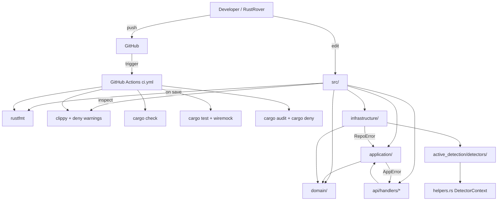

# Requirements

### Overview & Goals
Limma backend (Rust 2021, ~24K satır, axum + sqlx + tokio) projesinin **kalite skorunu mevcut ~6/10'dan 10/10'a** çıkarmak. Hedef: production-ready bir Rust güvenlik tarayıcısı backend'i; tutarlı mimari, sıkı tooling, yüksek test kapsamı, modüler dosyalar, panik içermeyen üretim yolu, otomatize CI, IDE (RustRover) ile uyumlu geliştirici deneyimi.

### Scope

**In Scope**
- Tooling & quality gates: `rustfmt.toml`, `clippy.toml`, `deny.toml`, `.gitignore`, `.github/workflows/ci.yml`, RustRover ayar dosyaları (`.idea/inspectionProfiles`).
- Sıkı lint politikası: `#![deny(warnings)]` + `cargo clippy -- -D warnings` CI gate.
- Test kapsamı: her aktif detector için pozitif + negatif unit testler, `correlator`/`normalizer`/`scorer` için unit testler, API handler'ları için entegrasyon testleri (`axum::Router` + `tower::ServiceExt`).
- `.unwrap()` denetimi: 29 yerin tamamı incelenir; production yolundakiler `?` veya `expect("anlamlı mesaj")` ile değiştirilir.
- Detector boilerplate refaktörü: ortak request/WAF/rate-limit akışını yardımcı fonksiyona/struct'a taşı.
- Büyük dosyaları böl: `domain/entities.rs`, `api/handlers.rs`, `infrastructure/investigator.rs`, `cli/main.rs`.
- Domain repository hata tipleri: `Result<_, String>` → typed `RepoError` (thiserror).
- Geçici dosya temizliği: `errors.txt`, `warnings.txt`, `limma*.log`, `test_glob.rs` silinir + `.gitignore`'a eklenir.
- Bağımlılık güncellemesi: `sqlx 0.7 → 0.8` (future-incompat'ı kapatır), `cargo audit`/`cargo deny` taraması.
- Dokümantasyon: tüm public API'lara rustdoc; modül seviyesi `//!` açıklamaları; `cargo doc --no-deps` CI'da çalışır.
- RustRover (JetBrains) entegrasyonu: paylaşılan inspection profile, run/debug konfigürasyonları, file watcher (rustfmt), code coverage runner.

**Out of Scope**
- Yeni özellik/iş mantığı eklemek (yalnızca kalite & sağlamlaştırma).
- UI/frontend değişiklikleri.
- Veritabanı şeması değişiklikleri (mevcut migration'lar korunur).
- Performans optimizasyonu (ölçüm yapılmadan değişiklik yapılmaz).

### User Stories
- **As a** maintainer, **I want** her PR'da `fmt + clippy + check + test + audit` otomatik çalışsın **so that** rejim dışı kod ana branch'e giremesin.
- **As a** developer using RustRover, **I want** projeyi açar açmaz inspection profile + run config'ler hazır olsun **so that** ekstra kurulum yapmadan çalışabileyim.
- **As a** security engineer, **I want** her detector için en az pozitif + negatif test bulunsun **so that** false-positive/negative regresyonlarını yakalayabileyim.
- **As a** SRE, **I want** üretim yolunda `panic!`/`unwrap` olmasın **so that** servis stabilitesi öngörülebilir olsun.
- **As a** new contributor, **I want** dosyalar 500 satırı geçmesin ve modülerleşmiş olsun **so that** kod tabanına hızlıca adapte olabileyim.

### Functional Requirements
- `cargo fmt --check` 0 farkla geçmeli.
- `cargo clippy --all-targets --all-features -- -D warnings` 0 uyarı vermeli.
- `cargo check --all-targets` 0 warning + 0 error.
- `cargo test --all-targets` tüm testler yeşil; **toplam test sayısı ≥ 60** (mevcut 14'ten).
- `cargo audit` ve `cargo deny check` CI'da çalışmalı; bilinen kritik CVE bulunmamalı.
- Hiçbir kaynak dosya 500 satırı geçmemeli (istisnalar: rules/templates).
- Production binary'sinde `unwrap()` çağrısı yalnızca test/cli yardımcılarında veya yorumlu istisnalarda olabilir; her birinin gerekçesi rustdoc/yorumla belgelenmeli.
- Tüm public item'lar rustdoc'lu olmalı (`#![warn(missing_docs)]` etkin).
- `RustRover → Code → Reformat with rustfmt` ve `Run cargo clippy` aksiyonları doğrudan çalışmalı.

### Non-Functional Requirements
- **Geri uyumluluk**: API yüzeyi (HTTP route'ları + DTO'lar) korunmalı.
- **Yeniden derleme süresi**: refactor sonrası `cargo check` süresi mevcudun %20'sinden fazla artmamalı.
- **Bakım**: stale dosya bırakılmamalı; `.gitignore` log/coverage/IDE çıktılarını kapsamalı.
- **Tooling reproducibility**: `rust-toolchain.toml` ile pinli Rust sürümü.


# Technical Design

### Current Implementation
- **Mimari**: katmanlı / DDD benzeri — `api/`, `application/`, `domain/`, `infrastructure/`, `shared/`, `cli/`. Modülerlik iyi, sınırlar net.
- **Tech stack**: `axum 0.7`, `tokio 1`, `sqlx 0.7 (postgres + rustls)`, `tower-http`, `tower_governor`, `tracing`, `reqwest 0.12`, `thiserror 2 + anyhow 1`, `dashmap`, `serde_yaml`. Cargo features: `cli` opsiyonel.
- **Detector trait mevcut**: `src/infrastructure/active_detection/detectors/mod.rs` içinde `pub trait VulnDetector` zaten tanımlı. Sorun: trait var ama her detector implementasyonu ~30 satırlık aynı boilerplate'i (payload iter, rate-limit sleep, request build, WAF register, response decode) tekrarlıyor.
- **Hata yönetimi**: API katmanında `AppError` (`src/error.rs` + `src/api/...`) iyi; ancak domain repository trait'leri `Result<(), String>` / `Result<_, String>` dönüyor (örn. `domain/repositories.rs:147` `ActiveScanRepository`). Bu typed olmalı.
- **Test durumu**: yalnızca 14 test; 11 tanesi `correlator.rs` içinde gömülü `mod tests`, kalanlar dağınık. Detector'lar için **0 unit test**.
- **Büyük dosyalar (≥500 satır)**: `domain/entities.rs` (1590), `infrastructure/investigator.rs` (1041), `api/handlers.rs` (995), `infrastructure/collector/fingerprint_registry.rs` (706), `cli/main.rs` (594), `infrastructure/auditor/correlator.rs` (563), `infrastructure/burp_bridge/mod.rs` (559), `infrastructure/collector/signature_evaluator.rs` (539), `infrastructure/auditor/client.rs` (516), `infrastructure/rule_engine/evaluator.rs` (483).
- **`.unwrap()` dağılımı (29 toplam)**:
  - `infrastructure/active_detection/detectors/sqli_detector.rs` — 17 (regex/parsing → `OnceLock` + `expect` veya `?`)
  - `infrastructure/repositories/active_finding_repo.rs` — 6 (sqlx row map → `?` ile RepoError'a)
  - `infrastructure/rule_engine/encoding_detector.rs` — 3
  - `loader.rs`, `correlator.rs`, `active_scan_repo.rs` — 1'er.
- **Tooling eksiği**: git repo yok, `.gitignore` yok, `.github/` CI yok, `rustfmt.toml`/`clippy.toml` yok, `rust-toolchain.toml` yok, RustRover paylaşılan ayarları yok.
- **Bağımlılık uyarısı**: `sqlx-postgres v0.7.4` future-incompat (Rust ileri sürümlerce reddedilecek). Çözüm: `sqlx 0.8`'a yükselt.

### Key Decisions
1. **Lint politikası: `#![deny(warnings)]` crate kökünde + CI'da `clippy -D warnings`.** *Gerekçe:* warning kirliliğini sıfırlamanın tek yolu derleme zamanı zorlamasıdır; lokal IDE zaten temiz olduğu için risk düşük.
2. **`sqlx 0.7 → 0.8` yükseltmesi planın bir parçası.** *Gerekçe:* future-incompat uyarısını kapatır, yeni `query!` API'si daha sağlam. Riski izole etmek için tek bir stage'de yapılır + tüm sqlx çağrı yerleri smoke test'lenir.
3. **Detector boilerplate'ini trait üzerinden değil, bir `DetectorContext` helper'ı + extension fonksiyonları ile DRY'le.** *Gerekçe:* trait genişletmek mevcut imzayı kırar; yardımcı struct/fonksiyonlar (`DetectorContext::send_request`, `apply_rate_limit`, `register_waf_response`) geriye dönük uyumlu ve test edilebilir.
4. **Domain repo hataları için yeni `RepoError` (`thiserror`).** *Gerekçe:* `Result<_, String>` opaque ve test edilemez; `RepoError::NotFound | Database(sqlx::Error) | Conflict | Serialization(serde_json::Error)` API katmanında `AppError`'a `From` ile çevrilebilir.
5. **Dosya bölme stratejisi: domain'e göre alt-modül + `mod.rs` re-export.** *Gerekçe:* dış dünyaya görünen path'leri (`crate::domain::entities::Finding`) korumak için modülleri re-export'la aynı yüzeyi koru. Bu, çağrı yerlerinde minimum değişiklik demek.
6. **Test stratejisi: detector'lar için `wiremock` ile sahte HTTP server.** *Gerekçe:* `reqwest::Client`'ı mock'lamadan gerçek payload trafiğini doğrulamak mümkün; ekleme: `[dev-dependencies] wiremock = "0.6"`.
7. **CI: GitHub Actions tek workflow (`ci.yml`).** *Gerekçe:* basit, ücretsiz; matrix yok (Rust stable + Postgres service container) — proje tek platform odaklı.
8. **RustRover ayarları: `.idea/inspectionProfiles/Project_Default.xml` + `.idea/runConfigurations/*.xml` repo'ya commit edilir** (`.gitignore` `.idea/workspace.xml`'i hariç tutar). *Gerekçe:* takım ayar parite'si sağlar.

### Proposed Changes

#### A. Tooling & quality gates
- **Yeni dosyalar**:
  - `rust-toolchain.toml` → `[toolchain] channel = "stable"`.
  - `rustfmt.toml` → max_width = 100, edition = 2021, group_imports = "StdExternalCrate", imports_granularity = "Module".
  - `clippy.toml` → cognitive-complexity-threshold = 25, too-many-arguments-threshold = 8.
  - `deny.toml` → license + advisories + bans bölümleri (cargo-deny).
  - `.gitignore` → `target/`, `*.log`, `errors.txt`, `warnings.txt`, `*.tmp`, `.idea/workspace.xml`, `.idea/tasks.xml`, `.env`, `coverage/`.
  - `.github/workflows/ci.yml` → fmt + clippy + check + test + audit + deny job'ları.
- **Düzenlemeler**:
  - `src/main.rs` ve `src/cli/main.rs` başına `#![deny(warnings)]` + `#![warn(missing_docs)]`.
  - `Cargo.toml`'a `[dev-dependencies] wiremock = "0.6"`, `[dependencies] sqlx 0.7 → 0.8`.

#### B. `.unwrap()` denetimi (29 yer → ~0)
- `sqli_detector.rs` (17): regex'ler `OnceLock<Regex>` + `expect("valid sqli regex")` ile statik tanımlanır; `serde_json` parse vb. `?` ile `String` hatasına yayılır.
- `active_finding_repo.rs` (6): row mapping'lerde `?` + `RepoError::Database`.
- `encoding_detector.rs` (3), `loader.rs` (1), `correlator.rs` (1), `active_scan_repo.rs` (1): hepsi `?` veya gerekçeli `expect(...)` ile değiştirilir.

#### C. Detector boilerplate dedup
- `src/infrastructure/active_detection/detectors/helpers.rs` (yeni): `DetectorContext` struct'ı (`client`, `waf_monitor`, `rate_limit_ms`, `enable_waf_bypass`) + metodlar:
  - `async fn get(&self, url: &str) -> Result<Response, String>`
  - `fn build_test_url(base: &str, param: &str, payload: &str) -> String`
  - `fn handle_waf_response(&self, status: u16, target: &str)` (rate-limit double sleep dahil).
- Mevcut detector'lar bu helper'ları kullanacak şekilde sadeleşir; her detector ~30 → ~10 satır boilerplate'e iner.

#### D. Büyük dosyaları bölme
- `src/domain/entities.rs` (1590) → `src/domain/entities/{mod.rs, finding.rs, severity.rs, scope.rs, scan.rs, evidence.rs, poc.rs}`. `mod.rs` `pub use` ile aynı path'leri sergiler.
- `src/api/handlers.rs` (995) → `src/api/handlers/{mod.rs, scans.rs, findings.rs, poc.rs, verify.rs, audit.rs, common.rs}`.
- `src/infrastructure/investigator.rs` (1041) → `src/infrastructure/investigator/{mod.rs, http_probe.rs, dns_probe.rs, tls_probe.rs, signals.rs}`.
- `src/cli/main.rs` (594) → `src/cli/{main.rs, commands/scan.rs, commands/audit.rs, commands/report.rs, commands/mod.rs}`.
- `infrastructure/collector/fingerprint_registry.rs` (706) → registry + signatures alt modüllere.

#### E. Domain hata tipi
- `src/domain/errors.rs` (yeni): `pub enum RepoError { NotFound, Database(sqlx::Error), Conflict, Serialization(serde_json::Error), Other(String) }` (`thiserror`).
- `src/domain/repositories.rs`: tüm trait metodlarının dönüş tipi `Result<_, String>` → `Result<_, RepoError>`.
- `src/error.rs` (`AppError`): `From<RepoError> for AppError` impl ekle.

#### F. Test kapsamı genişletme
- `tests/api_smoke.rs` (yeni): `axum::Router` + `tower::ServiceExt::oneshot` ile başlıca route'lar (health, scans CRUD, findings list, poc generate) için entegrasyon testi.
- Her detector için `tests` modülü (in-file `#[cfg(test)] mod tests`): pozitif (vuln var) + negatif (clean response) senaryoları `wiremock`'la.
- `correlator.rs` mevcut 3 → 8 test'e (hijyen kapısı, CSP_XSS, CORS_CREDENTIAL_HIJACK, duplicate detection, severity escalation).
- `auditor/scorer.rs`, `auditor/normalizer.rs`, `rule_engine/evaluator.rs`, `rule_engine/encoding_detector.rs` için unit testler.
- Hedef: **toplam ≥ 60 test**.

#### G. RustRover entegrasyonu
- `.idea/inspectionProfiles/Project_Default.xml` → Rust + Cargo + Clippy inspection'ları açık, severity = Error.
- `.idea/runConfigurations/Cargo_Check.xml`, `Cargo_Test.xml`, `Cargo_Clippy.xml`, `Cargo_Run.xml` → paylaşılan run config'ler.
- `.idea/externalDependencies.xml` → RustRover plugin gerekliliği.
- `README.md`'ye "Open in RustRover" bölümü: file watcher (rustfmt-on-save), Database tool ile sqlx şema bağlama, code coverage (`Run with Coverage` üzerinden tarpaulin entegrasyonu).

### Data Models / Contracts
```rust
// src/domain/errors.rs
#[derive(Debug, thiserror::Error)]
pub enum RepoError {
    #[error("resource not found")]
    NotFound,
    #[error("database error: {0}")]
    Database(#[from] sqlx::Error),
    #[error("conflict: {0}")]
    Conflict(String),
    #[error("serialization error: {0}")]
    Serialization(#[from] serde_json::Error),
    #[error("other: {0}")]
    Other(String),
}

// src/infrastructure/active_detection/detectors/helpers.rs
pub struct DetectorContext<'a> {
    pub client: &'a reqwest::Client,
    pub waf_monitor: std::sync::Arc<WafMonitor>,
    pub rate_limit_ms: u64,
    pub enable_waf_bypass: bool,
}
impl<'a> DetectorContext<'a> {
    pub async fn send_get(&self, url: &str, target: &str) -> Result<reqwest::Response, String> { /* rate-limit + waf-bypass + register */ }
    pub fn build_param_url(base: &str, param: &str, payload: &str) -> String { /* ... */ }
}
```

### File Structure
```
backend/
├── .cargo/config.toml                 (mevcut)
├── .github/workflows/ci.yml           (yeni)
├── .gitignore                         (yeni)
├── .idea/                             (yeni: paylaşılan inspection + run configs)
├── Cargo.toml                         (sqlx 0.8 + wiremock)
├── clippy.toml                        (yeni)
├── deny.toml                          (yeni)
├── rust-toolchain.toml                (yeni)
├── rustfmt.toml                       (yeni)
├── README.md                          (RustRover bölümü eklenir)
├── tests/
│   └── api_smoke.rs                   (yeni)
└── src/
    ├── main.rs                        (deny(warnings) eklenir)
    ├── error.rs                       (From<RepoError>)
    ├── domain/
    │   ├── entities/                  (eski tek dosya yerine bölünmüş)
    │   │   ├── mod.rs                 (re-export)
    │   │   ├── finding.rs
    │   │   ├── severity.rs
    │   │   ├── scope.rs
    │   │   ├── scan.rs
    │   │   ├── evidence.rs
    │   │   └── poc.rs
    │   ├── errors.rs                  (yeni: RepoError)
    │   └── repositories.rs            (Result<_, RepoError>)
    ├── api/
    │   └── handlers/                  (eski tek dosya yerine bölünmüş)
    │       ├── mod.rs
    │       ├── scans.rs
    │       ├── findings.rs
    │       ├── poc.rs
    │       ├── verify.rs
    │       ├── audit.rs
    │       └── common.rs
    ├── cli/
    │   ├── main.rs
    │   └── commands/
    │       ├── mod.rs
    │       ├── scan.rs
    │       ├── audit.rs
    │       └── report.rs
    └── infrastructure/
        ├── investigator/              (bölünmüş)
        │   ├── mod.rs
        │   ├── http_probe.rs
        │   ├── dns_probe.rs
        │   ├── tls_probe.rs
        │   └── signals.rs
        └── active_detection/
            └── detectors/
                ├── helpers.rs         (yeni: DetectorContext)
                └── ... (her detector helpers'ı kullanır + tests modülü)
```

### Architecture Diagram


### Risks
- **`sqlx 0.7 → 0.8` breaking change**: query macro davranışı değişti; tüm `query!`/`query_as!` çağrıları derleme aşamasında doğrulanmalı. *Mitigation:* tek stage'de izole et, her sqlx dosyası için lokal `cargo check` çalıştır.
- **Dosya bölme path sapması**: `pub use` ile re-export edilmezse 100+ çağrı yeri kırılır. *Mitigation:* her bölme adımında önce eski dosyada `mod` deklarasyonu + `pub use *`, sonra içeriği taşı; her adımda `cargo check`.
- **`#![deny(warnings)]` aşırı sıkı**: `cfg(test)` veya feature-gated kodda nadir warning'leri kırabilir. *Mitigation:* gerektiğinde lokal `#[allow(...)]` ile kapatılır, gerekçe yorumla belgelenir.
- **Test sayısını artırırken yanlış pozitif false-positive'ler**: detector mantığını değiştirmemek için testler sadece mevcut davranışı sabitler (golden test yaklaşımı).
- **`.idea/` commit'i**: takım üyelerinde lokal değişiklikler conflict yapabilir. *Mitigation:* sadece paylaşılması anlamlı dosyalar commit edilir (`workspace.xml` hariç).


# Testing

### Validation Approach
Her stage sonunda **`cargo fmt --check && cargo clippy --all-targets --all-features -- -D warnings && cargo check --all-targets && cargo test --all-targets`** çalıştırılır. Stage'in kabul kriteri: 0 fmt fark, 0 clippy uyarı, 0 derleme uyarı, tüm testler yeşil.

### Key Scenarios
- **Tooling stage**: `cargo fmt --check` 0 fark; `cargo clippy -- -D warnings` ilk çalıştırmada başarısız olursa düzeltmeler aynı stage içinde yapılır.
- **`.unwrap()` stage**: `Get-ChildItem src -Recurse -Filter *.rs | Select-String '\.unwrap\(\)'` → 0 production-yolu sonucu (sadece `#[cfg(test)]` veya `expect-with-comment`).
- **Detector dedup**: refactor öncesi/sonrası `cargo test` aynı sonucu verir; davranışsal regresyon yok.
- **File split**: bölme öncesi/sonrası `cargo check` aynı sembolleri çözer; `cargo doc --no-deps` 0 broken-link.
- **sqlx 0.8 yükseltme**: tüm `query!` makroları compile-time'da DB şemasına bağlı kalır; `cargo sqlx prepare` çalıştırılır ve `.sqlx/` snapshot'ı commit edilir.
- **CI**: PR mock'u (lokal `act` veya manual workflow_dispatch) ile yeşil geçer.

### Edge Cases
- **Repo trait dönüş tipi değişimi**: tüm impl'ler ve çağrı yerleri (`?` operatörünün yayılımı `String`'den `RepoError`'a) güncellenmeli — derleyici hepsini yakalar.
- **`.gitignore` etkisi**: mevcut `.env` dosyası git history'sinde değil ama silinmemeli; `.gitignore`'da `.env` listelenir.
- **`#![deny(warnings)]` + dependency macro**: bazı `derive` makroları transient warning üretebilir; `#[allow(...)]` ile yerel olarak susturulur.
- **wiremock + tokio**: `[dev-dependencies] wiremock = "0.6"` async-runtime uyumlu; `#[tokio::test]` zorunlu.
- **Büyük dosya bölme + IDE cache**: RustRover cache'i geçersizleşebilir; `File → Invalidate Caches` doc'a not düşülür.

### Test Changes
- **Eklenecek testler** (~46 yeni):
  - 11 detector × 2 (pozitif + negatif) = 22 test
  - `correlator` ek 5 test
  - `scorer`, `normalizer`, `context_evaluator` × 3-4 test = 12 test
  - `rule_engine/evaluator`, `encoding_detector` 4 test
  - `tests/api_smoke.rs` 5-6 entegrasyon testi
  - `RepoError` From-conversion 2 test
- **Mevcut testler korunur**: `correlator.rs` 3 test + diğer 11 test bozulmaz.
- **`#[ignore]` markerlı testler eklenmez**: tüm testler CI'da yeşil geçmek zorunda.


# Delivery Steps

###   Step 1: Tooling, quality gates ve geçici dosya temizliği
Proje kökünde temel kalite altyapısı oluşturulur ve eski geçici dosyalar temizlenir.

- `rust-toolchain.toml` ekle (`channel = "stable"`).
- `rustfmt.toml` ekle (max_width=100, group_imports=StdExternalCrate, imports_granularity=Module).
- `clippy.toml` ekle (cognitive-complexity-threshold=25, too-many-arguments-threshold=8).
- `deny.toml` ekle (advisories + licenses + bans bölümleri).
- `.gitignore` ekle: `target/`, `*.log`, `errors.txt`, `warnings.txt`, `*.tmp`, `.idea/workspace.xml`, `.idea/tasks.xml`, `coverage/`, `.env.local`.
- Kökteki stale dosyaları sil: `errors.txt`, `warnings.txt`, `limma.log`, `limma_debug.log`, `test_glob.rs`.
- `git init` + ilk commit (kullanıcı onaylarsa); aksi halde sadece dosyalar oluşturulur.
- `src/main.rs` ve `src/cli/main.rs` başlarına `#![deny(warnings)]` + `#![warn(missing_docs)]` ekle, ortaya çıkan eksik docları kapat.
- Doğrulama: `cargo fmt --check`, `cargo clippy --all-targets -- -D warnings`, `cargo check`, `cargo test` (tümü 0 hata).

###   Step 2: GitHub Actions CI ve RustRover paylaşılan ayarları
PR'larda otomatik kalite kontrol ve RustRover'da ortak geliştirici deneyimi sağlanır.

- `.github/workflows/ci.yml` oluştur: `fmt-check`, `clippy`, `check`, `test`, `audit` (cargo-audit), `deny` (cargo-deny) job'ları; Postgres service container ile sqlx testleri.
- `cargo-audit` ve `cargo-deny` install adımları cache'lenir.
- `.idea/inspectionProfiles/Project_Default.xml` oluştur: Rust + Cargo + Clippy inspection'ları aktif, severity=Error.
- `.idea/runConfigurations/` altına `Cargo_Check.xml`, `Cargo_Test.xml`, `Cargo_Clippy_All.xml`, `Cargo_Run_Server.xml` ekle.
- `README.md`'ye "Development with RustRover" bölümü: file watcher (rustfmt-on-save), Database Tools ile sqlx şema bağlama, Run with Coverage talimatı.
- Doğrulama: `act` veya manuel `workflow_dispatch` ile CI yeşil; RustRover'da run config'ler dropdown'dan seçilebilir.

###   Step 3: Domain hata tipi (`RepoError`) ve repository imzalarının typed hâle getirilmesi
`Result<_, String>` opaque hataları typed `RepoError`'a dönüştürülür.

- `src/domain/errors.rs` oluştur: `RepoError` enum (`NotFound`, `Database(sqlx::Error)`, `Conflict(String)`, `Serialization(serde_json::Error)`, `Other(String)`) — `thiserror` ile.
- `src/domain/repositories.rs`: tüm trait metodlarının dönüş tipini `Result<_, String>` → `Result<_, RepoError>` olarak değiştir.
- `src/infrastructure/repositories/*.rs` impl'lerini güncelle (sqlx hataları `?` ile yayılır).
- `src/error.rs` (`AppError`)'a `impl From<RepoError> for AppError` ekle.
- `src/api/handlers/*` çağrı yerlerinde `.map_err(AppError::Internal)` çağrılarını sadeleştir (`?` doğrudan çalışır).
- Doğrulama: `cargo check` + `cargo test` yeşil; tüm `Result<_, String>` referansları kaldırıldı.

###   Step 4: `.unwrap()` denetimi ve detector boilerplate dedup
29 `.unwrap()` panik noktası temizlenir ve detector dosyalarındaki tekrar eden HTTP/WAF boilerplate ortak helper'a taşınır.

- `sqli_detector.rs` (17): regex'ler `OnceLock<Regex>` + `expect("valid sqli regex")` ile statikleşir; runtime parse'lar `?` ile yayılır.
- `active_finding_repo.rs` (6), `encoding_detector.rs` (3), `loader.rs` / `correlator.rs` / `active_scan_repo.rs` (1'er): tümünde `unwrap()` → `?` (RepoError üzerinden) veya gerekçeli `expect`.
- `src/infrastructure/active_detection/detectors/helpers.rs` ekle: `DetectorContext { client, waf_monitor, rate_limit_ms, enable_waf_bypass }` + `send_get(url, target)`, `build_param_url(base, param, payload)`, `handle_waf_response(status, target)`.
- `cmdi_detector`, `lfi_detector`, `ssrf_detector`, `xxe_detector`, `redirect_detector`, `jwt_detector`, `xss_detector`, `nosql_detector`, `ssti_detector`, `idor_detector`, `deser_detector` dosyaları helper'ı kullanacak şekilde sadeleştirilir (her biri ~30 → ~10 satır boilerplate).
- Doğrulama: `cargo test` yeşil (davranışsal regresyon yok), `Select-String '\.unwrap\(\)'` → 0 production sonucu.

###   Step 5: Büyük dosyaları bölme (entities, handlers, investigator, cli, fingerprint_registry)
500+ satırlık tüm dosyalar modüler alt-dizinlere bölünür; dış API path'leri `pub use` ile korunur.

- `src/domain/entities.rs` (1590) → `src/domain/entities/{mod.rs, finding.rs, severity.rs, scope.rs, scan.rs, evidence.rs, poc.rs}`; `mod.rs` `pub use` re-export.
- `src/api/handlers.rs` (995) → `src/api/handlers/{mod.rs, scans.rs, findings.rs, poc.rs, verify.rs, audit.rs, common.rs}`.
- `src/infrastructure/investigator.rs` (1041) → `src/infrastructure/investigator/{mod.rs, http_probe.rs, dns_probe.rs, tls_probe.rs, signals.rs}`.
- `src/cli/main.rs` (594) → `src/cli/{main.rs, commands/{mod.rs, scan.rs, audit.rs, report.rs}}`.
- `src/infrastructure/collector/fingerprint_registry.rs` (706) → `fingerprint_registry/{mod.rs, registry.rs, signatures.rs}`.
- Her bölme sonrası `cargo check` ve `cargo test` çalıştırılır; çağrı yerleri değişmez (re-export sayesinde).
- Doğrulama: hiçbir dosya 500 satırı geçmez (rules/templates istisna), tüm testler yeşil.

###   Step 6: Test kapsamını ≥60'a çıkarma + sqlx 0.8 yükseltme
Detector'lar, correlator, scorer, normalizer, rule engine ve API handler'ları için yeni testler eklenir; sqlx future-incompat uyarısı kapatılır.

- `Cargo.toml`'a `[dev-dependencies] wiremock = "0.6"` ekle.
- Her detector için in-file `#[cfg(test)] mod tests`: pozitif (vuln var) + negatif (clean response) — wiremock ile sahte HTTP server. 11 detector × 2 = 22 test.
- `src/infrastructure/auditor/correlator.rs`: mevcut 3 → 8 test (CSP_XSS, CORS_CREDENTIAL_HIJACK, duplicate, severity escalation, hijyen kapısı varyasyonları).
- `auditor/scorer.rs`, `auditor/normalizer.rs`, `auditor/context_evaluator.rs`, `rule_engine/evaluator.rs`, `rule_engine/encoding_detector.rs` için unit testler (~12 test).
- `tests/api_smoke.rs` (yeni): `axum::Router` + `tower::ServiceExt::oneshot` ile health, scans CRUD, findings list, poc generate, verify finding rotaları için 5-6 entegrasyon testi.
- `RepoError` From-conversion için 2 test (`AppError::from(RepoError::NotFound)` vb.).
- `Cargo.toml`'da `sqlx 0.7 → 0.8` yükseltmesi: `cargo sqlx prepare` ile `.sqlx/` snapshot oluştur, repository impl'lerini yeni macro davranışına uyarla.
- Doğrulama: `cargo test --all-targets` toplam ≥60 test yeşil; `cargo check` 0 warning (sqlx future-incompat uyarısı dahil ortadan kalkar).