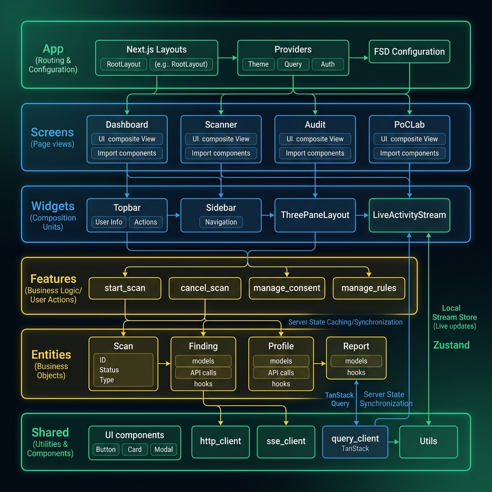

# LIMMA — Detaylı Frontend Mimari Raporu (Detailed Frontend Architecture Document)

Bu doküman, **LIMMA** güvenlik tarayıcısı frontend uygulamasının yazılımsal mimarisini, dizin yapısını, state yönetim modelini ve kritik veri akışlarını detaylı bir şekilde açıklamaktadır.

Uygulama, modern ve performanslı bir kullanıcı deneyimi sunmak amacıyla **React 18**, **Next.js (App Router)** ve **Tailwind CSS** teknolojileri üzerine inşa edilmiştir. Kod tabanı, modülerliği ve sürdürülebilirliği sağlamak amacıyla **Feature-Sliced Design (FSD)** mimari metodolojisini takip etmektedir.

**Önemli Paradigm Değişimi:** Limma bir pazarlama sitesi veya klasik scroll tabanlı web dashboard olarak tasarlanmamıştır. Tarayıcı teknolojileriyle geliştirilse bile kullanım modeli bir **bilgisayar programı / profesyonel güvenlik workstation'ı**dır.

---

## 1. Mimari Yaklaşım (Architectural Overview — Feature-Sliced Design)

LIMMA frontend mimarisi, ölçeklenebilirliği ve bağımsız bileşen geliştirmeyi desteklemek amacıyla **Feature-Sliced Design (FSD)** standartlarına göre katmanlandırılmıştır. Bağımlılık akışı her zaman üst katmanlardan alt katmanlara doğrudur (örneğin, bir `shared` modülü `features` modülüne bağımlı olamaz).

### FSD Katman Sorumlulukları

1.  **App Katmanı (`app`):** Uygulama genelindeki router tanımları (`layout.tsx`, `page.tsx` vb.), global CSS stilleri ve provider kurulumlarını (TanStack Query client provider) barındırır.
2.  **Screens/Pages Katmanı (`screens`):** Uygulamanın ana ekranlarını ve sayfalarını temsil eder (örneğin; Overview, Scans, Findings, Reports). Workspace mantığına göre `widgets` ve `features` bileşenlerini birleştirerek sayfa düzenini oluşturur.
3.  **Widgets Katmanı (`widgets`):** Ekranlardaki büyük ve kendi kendine yetebilen modüler bloklardır. Örneğin; `Topbar`, `Sidebar`, `ContextSwitcher`, `JobDrawer`.
4.  **Features Katmanı (`features`):** Kullanıcıya iş değeri sunan ve doğrudan aksiyon içeren eylemlerdir (örneğin; yeni tarama oluşturma `create-scan`, bulgu doğrulama `validate-finding`).
5.  **Entities Katmanı (`entities`):** İş alanındaki ana nesneleri ve bunların özel mantıklarını (business logic) barındırır (örneğin; `asset`, `scan`, `finding`, `evidence`, `job`, `report`).
6.  **Shared Katmanı (`shared`):** Proje genelinde kullanılan, iş mantığı içermeyen, tamamen yeniden kullanılabilir alt modüllerdir (API istemcisi `http-client.ts`, UI bileşenleri: Button, Input, Modal, Badge).

---

## 2. Workstation Tasarım İlkeleri

- **AppRoot:** Uygulama kökü `100dvh` yüksekliğe oturur; body seviyesinde kontrolsüz sayfa scroll'u oluşmaz (`overflow: hidden`).
- **Sidebar & Global Topbar:** Sabit kabuk (`fixed shell row/column`) parçalarıdır.
- **Paneller:** Liste, tablo, detail inspector ve activity alanları kendi içinde bağımsız scroll edilir. Inspector paneli gerektiğinde açılır kapanır formdadır.
- **Neon-Siyah Konsept:** Saf siyah zemin (`#030305`, `#07080B`) üzerinde neon mavi (`#00A8FF`) vurgularla odak belirleme ve profesyonel hacker stili korunur.
- **Target/Scan Context:** Sağlıksız global/gizli bağlamlar yerine tüm URL veya Topbar üzerinden net bir `WorkspaceContext` yönetimi sağlanır.

---

## 3. İstek ve State Akış Diyagramı (State Flow & Real-time Flow)

LIMMA frontend uygulamasında state yönetimi iki farklı kategoriye ayrılmıştır:
1.  **Server State (Sunucu Durumu):** TanStack Query (React Query) kullanılarak yönetilir. Tarama sonuçları, bulgular, ayarlar ve kural motoru verileri sunucudan çekilerek önbelleğe (cache) alınır ve senkronize edilir. (Örn: `useScans`, `useFindings`).
2.  **Client State (İstemci Durumu):** Zustand kullanılarak yönetilir. Gerçek zamanlı SSE olayları, UI filtreleri ve Job Drawer durumları bu alanda tutulur.

## 4. Geliştirme Standartları ve Kalite

- **API Adapter Pattern:** API'den (snake_case) gelen veriler adaptör katmanından geçerek (camelCase ve UI helperları eklenmiş olarak) Componentlere aktarılır.
- **Component Testleri:** Vitest ve Testing Library ile temel iş akışları (mapper testleri, hook testleri) test edilir. Playwright ile smoke/e2e testleri (ör: yeni scan oluşturma, kural silme) koşturulur.
