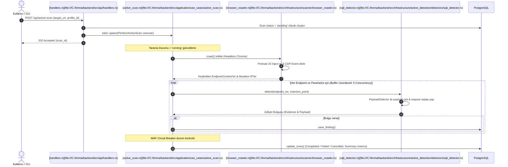
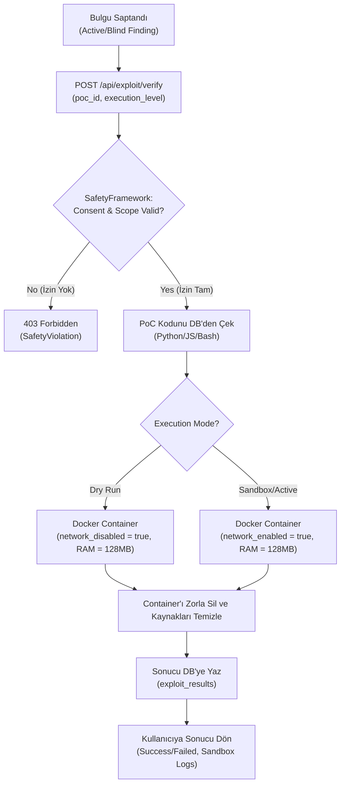

# LIMMA — Detaylı Backend Mimari Raporu (Detailed Backend Architecture Document)

Bu doküman, **LIMMA** güvenlik tarayıcısı backend uygulamasının yazılımsal mimarisini, veri modelini, bileşen hiyerarşisini ve kritik iş akışlarını detaylı bir şekilde açıklamaktadır. 

Uygulama, performans, tip güvenliği ve asenkron/eşzamanlı (concurrency) çalışma gereksinimlerini karşılamak amacıyla **Rust** diliyle yazılmış, **Tokio** asenkron çalışma motoru ve **Axum** web API çatısı (framework) üzerine inşa edilmiştir.

---

## 1. Mimari Yaklaşım (Architectural Overview — Clean Architecture)

LIMMA backend mimarisi, bağımlılıkları en aza indirmek ve test edilebilirliği artırmak için **Temiz Mimari (Clean Architecture / Onion Architecture)** prensiplerine göre tasarlanmıştır. Bağımlılık akışı her zaman dış katmanlardan iç katmanlara (Domain) doğrudur.

```mermaid
graph TD
    subgraph "API Layer (Axum Router & Handlers)"
        api_h["[handlers.rs](file:///C:/limma/backend/src/api/handlers.rs)"]
        api_m["[models.rs](file:///C:/limma/backend/src/api/models.rs)"]
    end

    subgraph "Application Layer (Use Cases)"
        uc_main["[mod.rs](file:///C:/limma/backend/src/application/use_cases/mod.rs)"]
        uc_scan["[active_scan.rs](file:///C:/limma/backend/src/application/use_cases/active_scan.rs)"]
        uc_strat["[scan_strategy.rs](file:///C:/limma/backend/src/application/scan_strategy.rs)"]
    end

    subgraph "Domain Layer (Core Entities & Interfaces)"
        dom_ent["[entities.rs](file:///C:/limma/backend/src/domain/entities.rs)"]
        dom_vuln["[active_vuln.rs](file:///C:/limma/backend/src/domain/active_vuln.rs)"]
        dom_repo["[repositories.rs](file:///C:/limma/backend/src/domain/repositories.rs)"]
        dom_serv["[services.rs](file:///C:/limma/backend/src/domain/services.rs)"]
        dom_cfg["[engine_config.rs](file:///C:/limma/backend/src/domain/engine_config.rs)"]
    end

    subgraph "Infrastructure Layer (Adapters & Engine Implementations)"
        infra_db["[db.rs](file:///C:/limma/backend/src/infrastructure/db.rs)"]
        infra_repo["[repositories](file:///C:/limma/backend/src/infrastructure/repositories)"]
        infra_crawl["[browser_crawler.rs](file:///C:/limma/backend/src/infrastructure/scanner/browser_crawler.rs)"]
        infra_rules["[rule_engine](file:///C:/limma/backend/src/infrastructure/rule_engine)"]
        infra_detect["[active_detection](file:///C:/limma/backend/src/infrastructure/active_detection)"]
        infra_sandbox["[docker_sandbox.rs](file:///C:/limma/backend/src/infrastructure/exploitation/sandbox/docker_sandbox.rs)"]
        infra_safety["[safety/mod.rs](file:///C:/limma/backend/src/infrastructure/safety/mod.rs)"]
    end

    %% Dependencies
    api_h --> uc_main
    uc_main --> dom_repo
    infra_repo --> dom_repo
    infra_crawl -.-> dom_repo
    infra_detect -.-> dom_repo
    infra_rules -.-> dom_repo
    infra_sandbox -.-> dom_repo
    infra_safety -.-> dom_repo
    dom_serv --> dom_ent
    dom_cfg --> dom_ent
```




### Katman Sorumlulukları
1. **API Katmanı (`api`):** HTTP isteklerini kabul eder, parametreleri doğrular (`[validate_external_url](file:///C:/limma/backend/src/api/handlers.rs)` vb.) ve bunları uygulama katmanındaki ilgili kullanım senaryolarına (Use Cases) yönlendirir. [Axum Web Server](file:///C:/limma/backend/src/main.rs) yapılandırmasını içerir.
2. **Application (Uygulama) Katmanı (`application`):** İş akışlarını koordine eder. Bir HTTP isteğinin, birden fazla servis veya veri tabanı işlemini tetiklemesini yönetir (örneğin; paralel çalışan reconnaissance fazları ve bunların sonucuna göre üretilen otomatik tarama stratejileri).
3. **Domain (İş Mantığı) Katmanı (`domain`):** Sistemdeki iş kurallarını, ana veri yapılarını (`entities`) ve altyapı katmanının implemente etmesi gereken arayüz tanımlarını (`repositories`) barındırır. Hiçbir harici framework veya kütüphane bağımlılığı içermez, tamamen saf Rust kodudur.
4. **Infrastructure (Altyapı) Katmanı (`infrastructure`):** Veri tabanı erişimi, harici HTTP çağrıları, headless tarayıcı kontrolü, Docker entegrasyonu, kural eşleştirme motoru ve güvenlik çerçeveleri gibi somut işleri üstlenen modülleri barındırır.

### Eylem/İstek Akış Şeması (Request & Execution Flow)

```
┌──────────────────────────────────────────────────────────────┐
│                    API HTTP / SSE REQUEST                    │
│    (POST /api/active-scan  |  POST /api/exploit/verify)      │
└─────────────┬───────────────────────────────┬────────────────┘
              │ (1) Validate URL & SSRF Check │ (1) Scope & Consent Check
              ▼                               ▼
┌────────────────────────────────┐  ┌──────────────────────────┐
│ [handlers.rs](file:///C:/limma/backend/src/api/handlers.rs)                    │  │ [safety/mod.rs](file:///C:/limma/backend/src/infrastructure/safety/mod.rs)            │
│                                │  │ (SafetyFramework)        │
│ • resolve_external_socket_addrs│  │                          │
│ • is_blocked_ip (RFC1918 block)│  │ • scope_enforcer         │
│ • allow_private_targets check  │  │ • consent_validator      │
│ • Axum AppState (Shared Arc)   │  │ • rate_limiter           │
└─────────────┬──────────────────┘  └─────────┬────────────────┘
              │                               │
              ▼ (2) Spawn tokio task          ▼ (2) Execute PoC
┌────────────────────────────────┐  ┌──────────────────────────┐
│ [active_scan.rs](file:///C:/limma/backend/src/application/use_cases/active_scan.rs)       │  │ [exploit_bridge.rs](file:///C:/limma/backend/src/infrastructure/exploitation/exploit_bridge.rs)        │
│ (PerformActiveScan)            │  │ (ExploitBridge)          │
│                                │  │                          │
│ • browser_crawler.rs (CDP SPA) │  │ • docker_sandbox.rs      │
│ • detectors/ (VulnDetectors)   │  │   (Bollard API)          │
│ • WafMonitor (circuit break)   │  │ • Offline/Online mode    │
└─────────────┬──────────────────┘  └─────────┬────────────────┘
              │                               │
              ▼ (3) Persist scan results      ▼ (3) Persist exploit results
┌──────────────────────────────────────────────────────────────┐
│                    POSTGRESQL DATABASE                       │
│                                                              │
│  active_scans ◄── active_findings ◄── exploit_verifications  │
│  settings_profiles  |  custom_rules  |  pocs                 │
└──────────────────────────────────────────────────────────────┘
```

---

## 2. Proje Dosya ve Klasör Yapısı (Directory & File Hierarchy)

Uygulamanın kaynak kod yapısı aşağıdaki gibi hiyerarşik olarak düzenlenmiştir:

### Bileşen Hiyerarşi Ağacı (Component Tree)

```
backend (Cargo.toml)
├── [main.rs](file:///C:/limma/backend/src/main.rs) (server bootstrap, dependency injection, Axum router init)
├── api/ (web api layer)
│   ├── [mod.rs](file:///C:/limma/backend/src/api/mod.rs)
│   ├── [handlers.rs](file:///C:/limma/backend/src/api/handlers.rs) (SSRF validation, rate limiters, auth resolvers, route handlers)
│   └── [models.rs](file:///C:/limma/backend/src/api/models.rs) (API Request/Response schemas)
├── application/ (application use cases layer)
│   ├── [mod.rs](file:///C:/limma/backend/src/application/mod.rs)
│   ├── [scan_strategy.rs](file:///C:/limma/backend/src/application/scan_strategy.rs) (AutonomousScanStrategyEngine → dynamic scan priorities)
│   └── use_cases/ (use cases coordinating domain interfaces)
│       ├── [active_scan.rs](file:///C:/limma/backend/src/application/use_cases/active_scan.rs) (PerformActiveScan → spawns tasks, manages concurrency)
│       ├── [blind_scan.rs](file:///C:/limma/backend/src/application/use_cases/blind_scan.rs) (PerformBlindScan)
│       ├── [generate_poc.rs](file:///C:/limma/backend/src/application/use_cases/generate_poc.rs) (GeneratePoc)
│       └── [verify_exploit.rs](file:///C:/limma/backend/src/application/use_cases/verify_exploit.rs) (VerifyExploit)
├── domain/ (core business entities and interfaces layer)
│   ├── [mod.rs](file:///C:/limma/backend/src/domain/mod.rs)
│   ├── [entities.rs](file:///C:/limma/backend/src/domain/entities.rs) (WebScanResult, ServerInfo, SecurityReport, Poc)
│   ├── [active_vuln.rs](file:///C:/limma/backend/src/domain/active_vuln.rs) (ActiveScanResult, ActiveVulnFinding)
│   ├── [repositories.rs](file:///C:/limma/backend/src/domain/repositories.rs) (WebsiteScanner, ActiveScanRepository traits)
│   ├── [services.rs](file:///C:/limma/backend/src/domain/services.rs) (ExploitSafetyService, BlindDetectionScoringService)
│   └── [engine_config.rs](file:///C:/limma/backend/src/domain/engine_config.rs) (EngineConfig resolver from SettingsProfile)
└── infrastructure/ (infrastructure adapters layer)
    ├── [mod.rs](file:///C:/limma/backend/src/infrastructure/mod.rs)
    ├── [db.rs](file:///C:/limma/backend/src/infrastructure/db.rs) (sqlx connection pool, migrations init)
    ├── repositories/ (pg repo implementations)
    │   ├── [active_scan_repo.rs](file:///C:/limma/backend/src/infrastructure/repositories/active_scan_repo.rs) (sqlx CRUD for active scans)
    │   ├── [active_finding_repo.rs](file:///C:/limma/backend/src/infrastructure/repositories/active_finding_repo.rs) (sqlx CRUD for findings)
    │   └── [pg_settings.rs](file:///C:/limma/backend/src/infrastructure/repositories/pg_settings.rs) (system settings profile in pg JSONB)
    ├── scanner/ (recon scanners & crawlers)
    │   ├── [browser_crawler.rs](file:///C:/limma/backend/src/infrastructure/scanner/browser_crawler.rs) (CDP-based headless crawler, fetch/XHR hook preload)
    │   └── [correlation.rs](file:///C:/limma/backend/src/infrastructure/scanner/correlation.rs) / [security.rs](file:///C:/limma/backend/src/infrastructure/scanner/security.rs) / [fingerprint.rs](file:///C:/limma/backend/src/infrastructure/scanner/fingerprint.rs)
    ├── active_detection/ (vulnerability detectors engine)
    │   ├── [mod.rs](file:///C:/limma/backend/src/infrastructure/active_detection/mod.rs) (orchestrates 12 VulnDetectors)
    │   ├── detectors/ (sqli_detector.rs, xss_detector.rs, ssrf_detector.rs, idor_detector.rs)
    │   └── fuzzing/ ([request_replayer.rs](file:///C:/limma/backend/src/infrastructure/active_detection/fuzzing/request_replayer.rs) → scope enforcer replay, [json_mutator.rs](file:///C:/limma/backend/src/infrastructure/active_detection/fuzzing/json_mutator.rs))
    ├── exploitation/ (poc generation & execution)
    │   ├── [exploit_bridge.rs](file:///C:/limma/backend/src/infrastructure/exploitation/exploit_bridge.rs) (SafetyFramework validation & DockerSandbox bridge)
    │   └── sandbox/ ([docker_sandbox.rs](file:///C:/limma/backend/src/infrastructure/exploitation/sandbox/docker_sandbox.rs) → Bollard node/python container isolation)
    └── safety/ (safety guards, consents and scopes)
        ├── [scope_enforcer.rs](file:///C:/limma/backend/src/infrastructure/safety/scope_enforcer.rs) (allowed target domains)
        ├── [consent_validator.rs](file:///C:/limma/backend/src/infrastructure/safety/consent_validator.rs) (consent record query & checks)
        ├── [rate_limiter.rs](file:///C:/limma/backend/src/infrastructure/safety/rate_limiter.rs) (rate check at IP/domain level)
        └── [waf_monitor.rs](file:///C:/limma/backend/src/infrastructure/safety/waf_monitor.rs) (circuit breaker on repeated blocks)
```

*   **`backend/`** - Ana Rust Backend Projesi
    *   **`migrations/`** - Veri tabanı schema şablonları
        *   `[202606120001_initial_schema.sql](file:///C:/limma/backend/migrations/202606120001_initial_schema.sql)`: İlk kurulum şeması
    *   **`rules/`** - Statik ve dinamik güvenlik kontrol kuralları (YAML dosyaları)
    *   **`src/`** - Rust kaynak dosyaları
        *   `[main.rs](file:///C:/limma/backend/src/main.rs)`: Uygulamanın giriş noktası (bootstrap), veritabanı bağlantısı, bağımlılık enjeksiyonu ve Axum router kurulumu.
        *   `[lib.rs](file:///C:/limma/backend/src/lib.rs)`: Crate modül ağacı tanımları.
        *   `[error.rs](file:///C:/limma/backend/src/error.rs)`: Merkezi hata yönetim yapıları (`AppError`).
        *   **`api/`** - Web katmanı
            *   `[mod.rs](file:///C:/limma/backend/src/api/mod.rs)`: API modül bildirimleri.
            *   `[handlers.rs](file:///C:/limma/backend/src/api/handlers.rs)`: İstekleri karşılayan, validasyon (SSRF koruması, izin kontrolleri vb.) yapan ve yanıt üreten handler fonksiyonları.
            *   `[models.rs](file:///C:/limma/backend/src/api/models.rs)`: Yalnızca API istek ve yanıtlarında kullanılan veri yapıları.
        *   **`application/`** - İş akışı koordinasyonu
            *   `[mod.rs](file:///C:/limma/backend/src/application/mod.rs)`: Use Case re-export tanımları.
            *   `[scan_strategy.rs](file:///C:/limma/backend/src/application/scan_strategy.rs)`: `AutonomousScanStrategyEngine` - Keşif bulgularına göre otomatik tarama önceliklendirmesi.
            *   **`use_cases/`** - Bağımsız kullanım senaryoları
                *   `[active_scan.rs](file:///C:/limma/backend/src/application/use_cases/active_scan.rs)`: Aktif güvenlik taramasının paralel çalıştırılması ve yönetimi.
                *   `[blind_scan.rs](file:///C:/limma/backend/src/application/use_cases/blind_scan.rs)`: Blind (zamanlama bazlı) güvenlik testlerinin yönetimi.
                *   `[generate_poc.rs](file:///C:/limma/backend/src/application/use_cases/generate_poc.rs)`: Bulunan açıklar için doğrulanabilir istismar kodu (PoC) üretimi.
                *   `[verify_exploit.rs](file:///C:/limma/backend/src/application/use_cases/verify_exploit.rs)`: PoC kodunun Docker sandbox'ta çalıştırılması.
        *   **`domain/`** - İş Kuralları ve Çekirdek Yapılar
            *   `[entities.rs](file:///C:/limma/backend/src/domain/entities.rs)`: `WebScanResult`, `ServerInfo`, `SecurityReport`, `Poc` vb. veri yapıları.
            *   `[active_vuln.rs](file:///C:/limma/backend/src/domain/active_vuln.rs)`: Aktif tarayıcıya özgü `ActiveScanResult`, `ActiveVulnFinding`, `PayloadDefinition` yapıları.
            *   `[repositories.rs](file:///C:/limma/backend/src/domain/repositories.rs)`: Altyapının implemente edeceği traitler (`WebsiteScanner`, `ActiveScanRepository` vb.).
            *   `[services.rs](file:///C:/limma/backend/src/domain/services.rs)`: Bağımsız iş kuralları (örneğin; `ExploitSafetyService` ile istismar kodunun risk seviyesi tayini).
            *   `[engine_config.rs](file:///C:/limma/backend/src/domain/engine_config.rs)`: `EngineConfig` - Profil ayarlarını (örneğin port aralığı veya wordlist boyutu) tarayıcıların anlayacağı konfigürasyona dönüştüren adaptör.
        *   **`infrastructure/`** - Somut Teknolojik Implementasyonlar
            *   `[db.rs](file:///C:/limma/backend/src/infrastructure/db.rs)`: PostgreSQL bağlantı havuzu ve sqlx entegrasyonu.
            *   **`repositories/`** - PostgreSQL Repository Implementasyonları
                *   `[active_scan_repo.rs](file:///C:/limma/backend/src/infrastructure/repositories/active_scan_repo.rs)`: Aktif taramaları DB'ye kaydeder ve günceller.
                *   `[active_finding_repo.rs](file:///C:/limma/backend/src/infrastructure/repositories/active_finding_repo.rs)`: Bulunan aktif tarama zafiyetlerini kaydeder.
                *   `[pg_settings.rs](file:///C:/limma/backend/src/infrastructure/repositories/pg_settings.rs)`: Sistem ayarlarını (SettingsProfile) PostgreSQL'de saklar.
            *   **`scanner/`** - Tarayıcılar ve Keşif Bileşenleri
                *   `[browser_crawler.rs](file:///C:/limma/backend/src/infrastructure/scanner/browser_crawler.rs)`: Headless Chrome CDP crawler.
            *   **`active_detection/`** - Aktif Tarayıcı Dedektörleri
                *   `[mod.rs](file:///C:/limma/backend/src/infrastructure/active_detection/mod.rs)`: Detektör orkestrasyonu.
                *   `detectors/`: SQLi (`[sqli_detector.rs](file:///C:/limma/backend/src/infrastructure/active_detection/detectors/sqli_detector.rs)`), XSS, SSRF, IDOR, LFI, RCE, JWT gibi 12 adet aktif tarama zafiyet dedektörü.
            *   **`rule_engine/`** - Kural Değerlendirme Motoru
                *   `[engine.rs](file:///C:/limma/backend/src/infrastructure/rule_engine/engine.rs)`: YAML tabanlı kuralları okuma, kural kalibrasyonu yapma ve eşleştirme.
            *   **`exploitation/`** - PoC Üretim ve Doğrulama
                *   `[exploit_bridge.rs](file:///C:/limma/backend/src/infrastructure/exploitation/exploit_bridge.rs)`: Güvenlik çerçevesi ile sandbox verifier arasındaki köprü.
                *   `sandbox/`: Bollard kütüphanesi kullanarak Docker container içinde istismar kodu çalıştırma (`[docker_sandbox.rs](file:///C:/limma/backend/src/infrastructure/exploitation/sandbox/docker_sandbox.rs)`).
            *   **`safety/`** - Güvenlik ve SSRF/WAF Filtreleri
                *   `[mod.rs](file:///C:/limma/backend/src/infrastructure/safety/mod.rs)`: `SafetyFramework` - Target doğruluğu, rate limit ve L3 yetkilendirmesi.
*   **`limma-shared/`** - Paylaşılan Rust Modülü
    *   `[dto.rs](file:///C:/limma/limma-shared/src/dto.rs)`: CLI (`limma-cli`) ve backend (`limma-backend`) arasında paylaşılan, DB bağımlılığı olmayan hafif API Request/Response DTO'ları (`ActiveScanRequest`, `BlindScanRequest` vb.).

---

## 3. Veritabanı Şeması ve İlişkisel Model (Database Schema)

LIMMA, kalıcı veri saklama alanı olarak **PostgreSQL** kullanır. `[initial_schema.sql](file:///C:/limma/backend/migrations/202606120001_initial_schema.sql)` dosyasında tanımlı olan 16 adet tablo ve bunların ilişkileri aşağıda özetlenmiştir:

| Tablo Adı | Birincil Anahtar (PK) | Yabancı Anahtarlar (FK) / İlişkiler | Amaç ve Saklanan Veri |
|---|---|---|---|
| **`settings_profiles`** | `id` (VARCHAR) | - | Tarama profili yapılandırması (örneğin; `default`, `fast`, `deep` vb. profillerin JSONB verisi). |
| **`custom_rules`** | `id` (VARCHAR) | - | Kullanıcı tarafından arayüz üzerinden yüklenen ve kural motoruna dinamik olarak hot-load edilen YAML içerikleri. |
| **`active_scans`** | `id` (UUID) | - | Aktif taramaların ana kaydı (hedef URL, durum: `pending`, `running`, `completed` vb., süre ve özet metrikler). |
| **`active_findings`** | `id` (UUID) | `scan_id` -> `active_scans.id` (ON DELETE CASCADE) | Aktif tarama sonucunda tespit edilen güvenlik açıkları (zafiyet tipi, parametre, kanıt isteği/yanıtı ve WAF bypass durumları). |
| **`exploit_verifications`** | `id` (UUID) | `finding_id` -> `active_findings.id`, `poc_id` -> `pocs.id` | Bulguların istismar doğrulama geçmişi (çalışma seviyesi, başarı durumu ve harcanan süre). |
| **`pocs`** | `id` (UUID) | - | Tespit edilen açıklar için otomatik üretilen istismar kodları (dil: Python/JS/Bash, kod metni, güvenlik seviyesi: L1-L3). |
| **`exploit_results`** | `id` (UUID) | `poc_id` -> `pocs.id` (ON DELETE CASCADE) | PoC kodunun Docker sandbox ortamında çalıştırılma çıktıları, başarı flagi ve logları. |
| **`consent_records`** | `id` (UUID) | - | L3 (aktif yıkıcı yöntemler) exploit doğrulaması için alınan kullanıcı izin kayıtları (domain, izin seviyesi, son kullanma tarihi). |
| **`scan_sessions`** | `id` (UUID) | - | Pasif/Recon tarama geçmişinin ana seansı. |
| **`scan_endpoints`** | `id` (SERIAL) | `scan_id` -> `scan_sessions.id` | Tarama esnasında keşfedilen HTTP endpoint listesi. |
| **`scan_findings`** | `id` (SERIAL) | `scan_id` -> `scan_sessions.id` | Pasif taramalar sonucunda kural motorunun ürettiği statik/pasif bulgular. |
| **`blind_findings`** | `id` (UUID) | - | Zamanlama (timing) bazlı blind zafiyet tespitleri (istismar yöntemi, timing kanıtı). |
| **`confidence_calibration`**| `signature` (VARCHAR)| - | Zafiyet imzalarının istatistiksel doğruluk kaydı (toplam deneme, başarılı/başarısız doğrulama oranları). |
| **`learning_feedback`** | `id` (SERIAL) | - | Makine öğrenmesi ve kural motoru için kullanıcıdan gelen doğrulama geri bildirimleri (False Positive / True Positive). |
| **`payload_library`** | `id` (UUID) | - | Aktif fuzzing testlerinde kullanılan payload veri tabanı (tür, beklenen imza, üretim ortamı güvenliği). |
| **`audit_logs`** | `id` (UUID) | - | Sistem üzerinde yapılan kritik eylemlerin güvenlik günlüğü (aksiyon, detaylar, eylemi gerçekleştiren aktör). |

---

## 4. Kritik Eşzamanlı İş Akışları (Key Core Pipelines)

### 4.1. Aktif Tarama Yaşam Döngüsü (Active Scan Pipeline)
Kullanıcı bir tarama başlattığında Axum handler'ı isteği alır ve Rust'ın eşzamanlılık modelinden faydalanarak tarama sürecini arka planda asenkron bir görev (`tokio::spawn`) olarak başlatır.



### 4.2. Blind Tarama ve Sandbox İstismar Doğrulama Akışı
Blind tarama ve zafiyet doğrulama süreci, izole ortamlarda güvenli test yapılabilmesini sağlar.



### 4.3. Kural Değerlendirme Motoru (Dynamic Rule Engine Pipeline)
`[DynamicRuleEngine](file:///C:/limma/backend/src/infrastructure/rule_engine/engine.rs)` bileşeni, tarama sonuçlarını pasif kurallarla (YAML tanımları) zenginleştiren, yanlış alarmları (False Positive) en aza indiren dinamik yapıya sahiptir.

```
[YAML Kuralları] ─────────► [loader.rs] ──────► [validator.rs] ───► [Active Rules Vector]
                                                                        ▲
[PostgreSQL custom_rules] ─────────────────────────── Hot-load ─────────┘
                                                                        │
[Scan HTTP Context] ────► Pre-Filter (Content-Type / Safe Path) ────────┤
                                                                        ▼
                                                             [evaluator.rs: evaluate]
                                                                        │
                                                                        ▼
                                                             [feedback.rs: Calibrate]
                                                              (Reputation Score adjustment)
                                                                        │
                                                                        ▼
                                                             Deduplicate & Supersede
                                                                        │
                                                                        ▼
                                                             [NormalizedAuditReport]
```

---

## 5. İleri Düzey Alt Bileşen Analizi (Advanced Components)

### 5.1. Browser Crawler (CDP & SPA Entegrasyonu)
`[BrowserCrawler](file:///C:/limma/backend/src/infrastructure/scanner/browser_crawler.rs)`, modern Tek Sayfa Uygulamalarını (SPA) taramak için `headless_chrome` kütüphanesini kullanır:
*   **CDP Ağı İzleme (Network.Enable):** Chrome DevTools Protocol üzerinden `NetworkRequestWillBeSent` olayını dinler. Bu sayede tarayıcının arka planda yaptığı tüm API çağrıları yakalanır.
*   **JS Enjeksiyonu (Preload Script):** Tarayıcı hedefe gitmeden önce `AddScriptToEvaluateOnNewDocument` ile pencereye bir hook script yerleştirilir. Bu script, `window.fetch` ve `XMLHttpRequest.prototype.open` metotlarını override ederek dinamik API isteklerini kaydeder.
*   **Normalizasyon ve Sanitizasyon:** Yakalanan istek header'larından `Host`, `Content-Length`, `Connection` gibi protokol düzeyindeki başlıklar temizlenerek `[replayable_request_headers](file:///C:/limma/backend/src/infrastructure/scanner/browser_crawler.rs#L233)` yardımıyla fuzzing replay işlemi için uygun hale getirilir.

### 5.2. Docker Sandbox (`[docker_sandbox.rs](file:///C:/limma/backend/src/infrastructure/exploitation/sandbox/docker_sandbox.rs)`)
Zafiyet doğrulamak için üretilen istismar kodları (PoC) yerel makinede çalıştırılamayacak kadar risklidir. Docker Sandbox:
*   Bollard kütüphanesi ile yerel Docker socket'e bağlanır.
*   PoC diline göre (`python:3.10-slim`, `node:18-alpine` veya `bash:latest`) uygun imajı otomatik olarak çeker.
*   Container oluştururken **128 MB RAM limiti** koyar.
*   `dry_run` modunda `network_disabled = true` (network modu: `none`) ayarlayarak kodun dış dünyaya erişmeden sadece yorumlanabilirliğini ve sözdizimini kontrol eder.
*   İşlem bittiğinde container'ı force (`force = true`) ederek tamamen yok eder.

### 5.3. Güvenlik ve SSRF/WAF Filtreleri
*   **SSRF Koruması:** `[resolve_external_socket_addrs](file:///C:/limma/backend/src/api/handlers.rs#L137)` fonksiyonu, hedef alan adını çözdükten sonra elde edilen IP adreslerini kontrol eder. Eğer adres RFC1918 (Private IP) veya Loopback (127.0.0.1) bloklarındaysa ve `LIMMA_ALLOW_PRIVATE_TARGETS=false` ise isteği anında sonlandırır.
*   **WAF İzleme (Circuit Breaker):** `[WafMonitor](file:///C:/limma/backend/src/infrastructure/safety/waf_monitor.rs)` bileşeni, hedef sunucunun tarama isteklerine verdiği yanıtları takip eder. Üst üste belirli sayıda "403 Forbidden" veya WAF imzalı HTTP yanıtı alındığında taramayı "Circuit Breaker Open" durumuna getirerek hedefin erişim engeli koymasını önlemek için tarama döngüsünü durdurur.

---

## 6. Mimari Tasarım Kararları (Architectural Decisions - ADRs)

1. **Performans ve Concurrency:** Güvenlik taramalarında aynı anda yüzlerce HTTP isteği atılması ve analiz edilmesi gerekir. Rust'ın **Tokio** kütüphanesi ile sağlanan asenkron mimari, işletim sistemi thread yükü oluşturmadan binlerce I/O işlemini verimli şekilde yönetir.
2. **Kural Kalibrasyonu (Feedback Loop):** Statik kurallar yüksek oranda False Positive üretebilir. LIMMA kural motoru, `[confidence_calibration](file:///C:/limma/backend/migrations/202606120001_initial_schema.sql#L10)` ve kullanıcı feedback verilerini birleştirerek kuralların repütasyon skorunu hesaplar. FP oranı yüksek olan kuralların güvenilirlik derecesi (`effective_confidence`) otomatik olarak düşürülür.
3. **Katmanlı Ayrışma:** DTO'lar `[limma-shared](file:///C:/limma/limma-shared/src/dto.rs)` içinde toplanmıştır. Bu sayede CLI aracı ve Web Backend aynı veri tiplerini kullanır, kod tekrarı önlenir ve API güncellemeleri iki tarafı da güvenle günceller.
