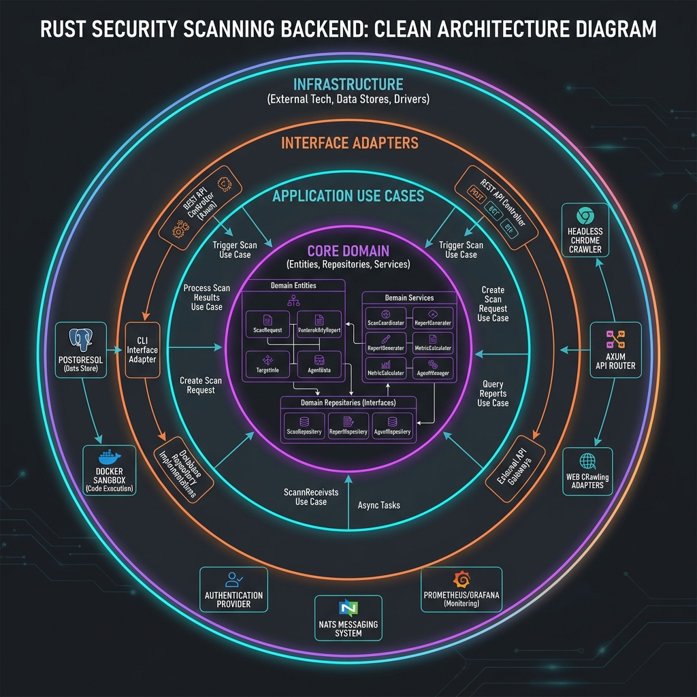

# LIMMA — Detaylı Backend Mimari Raporu (Detailed Backend Architecture Document)

Bu doküman, **LIMMA** güvenlik tarayıcısı backend uygulamasının yazılımsal mimarisini, veri modelini, bileşen hiyerarşisini ve kritik iş akışlarını detaylı bir şekilde açıklamaktadır. 

Uygulama, performans, tip güvenliği ve asenkron/eşzamanlı (concurrency) çalışma gereksinimlerini karşılamak amacıyla **Rust** diliyle yazılmış, **Tokio** asenkron çalışma motoru ve **Axum** web API çatısı (framework) üzerine inşa edilmiştir.

---

## 1. Mimari Yaklaşım (Architectural Overview — Clean Architecture)

LIMMA backend mimarisi, bağımlılıkları en aza indirmek ve test edilebilirliği artırmak için **Temiz Mimari (Clean Architecture / Domain-Driven Design)** prensiplerine göre tasarlanmıştır. Bağımlılık akışı her zaman dış katmanlardan iç katmanlara (Domain) doğrudur.

### Katman Sorumlulukları

1. **Domain Layer (`domain/`)**: Sistemin kalbidir. İş tipleri (Entities), kurallar, arayüzler ve epistemic honesty modelleri (`CertaintyLevel`, `SeverityLevel`, `ActiveVulnType`) burada bulunur. Hiçbir dış framework'e bağlı değildir.
2. **Application Layer (`application/`)**: Kullanıcı eylemlerini (Use Cases) barındırır. Örn: `active_scan.rs`, `scan_strategy.rs`.
3. **Infrastructure Layer (`infrastructure/`)**: Dış dünya ile iletişim. Veritabanı işlemleri (PostgreSQL/SQLx), Tarayıcı ve Analiz motorları (Scanner, Collector, Blind Detection), Güvenlik (Rate Limiter, Consent, Scope Enforcer).
4. **API Layer (`api/`)**: Axum ile HTTP rotalarının tanımlandığı, DTO (Data Transfer Object) çevrimlerinin ve auth guard işlemlerinin yapıldığı dış sunum katmanıdır.

---

## 2. Temel Mekanizmalar ve Güvenlik Altyapısı (Safety Framework)

Limma, güçlü tarama yeteneklerinin kötüye kullanılmaması için ciddi güvenlik katmanları içerir:

- **Scope Enforcer**: Taramaların yalnızca yetkili / izinli alan adlarına yapıldığını doğrular. (SSRF koruması ve private IP block özelliği de aktif)
- **Consent Validator (L3 Active Executions)**: Aktif ve yıkıcı potansiyeli olan payload'lar çalıştırılmadan önce veri tabanında (veya in-memory) onayın (consent) bulunmasını zorunlu tutar. Loglama (audit_log) ile desteklenir.
- **WAF Monitor / Rate Limiter**: Tarama esnasında hedefin durumunu izler, Tower tabanlı `tower_governor` ile API hız sınırı koyar ve 429/403/406 dönüşlerine göre taramayı otomatik frenler/keser.
- **SSRF & Private Target Guard**: Hedef IP çözümlemesinde internal ve private range tespit edildiğinde, `LIMMA_ALLOW_PRIVATE_TARGETS=true` olmadığı sürece isteği bloklar.

---

## 3. Dinamik Kural Motoru ve Zafiyet Analizi (Detection Modules)

Limma arka planda birçok detection modülü barındırır:
- **Active Detection**: SQLi (Error, Blind, Union, Boolean), XSS (Reflected, Stored, DOM), CMDi, LFI/RFI, SSRF vb. 28'den fazla zafiyet tipini tarar. PayloadSelector sayesinde `FuzzingIntensity` durumuna göre testler derinleşir.
- **Blind Detection**: Out-of-Band (OOB) ve gecikme (TimingAnalyzer) bazlı analizleri otonom gerçekleştirir.
- **Browser Crawler / Verification**: Headless Chrome (CDP protokolü üzerinden) ile DOM-XSS taraması, olay yakalama, header manipülasyonu yapar.

---

## 4. Teknik Borç ve Devam Eden İşler (Technical Debt & Roadmap)

Geçici placeholder olarak bırakılmış bileşenlerin gerçek ortam entegrasyonu hedeflenmektedir:
- `history_store.rs`: Halen bellekte (OnceLock<Mutex<HashMap>>) tutulan geçmiş taramaların Postgres'e geçirilmesi süreci.
- `rate_limiter.rs` (Exploit tarafı): In-memory implementasyonun çoklu instance desteği (Redis/DB) için güncellenmesi.
- `docker_sandbox.rs`: Exploit doğrulamasında sahte/mock altyapının yerine sağlam container tabanlı izolasyonun entegre edilmesi.
- Yüksek doğruluk için payload genişletmeleri (Örn: CMDi, SQLi, SSRF bypass varyantları).
